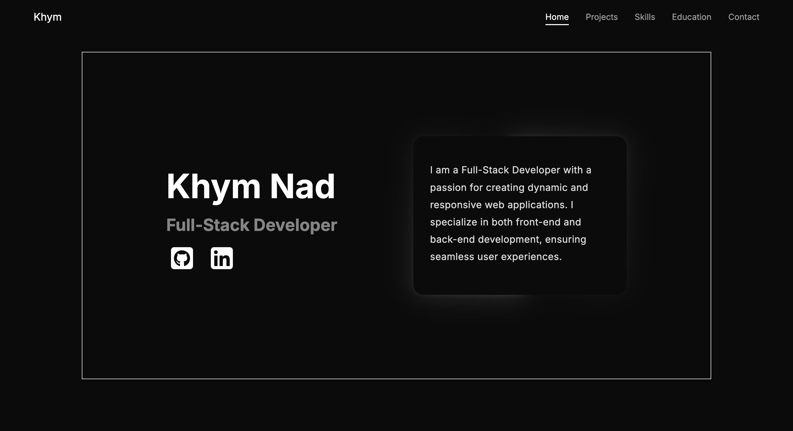

# 🚀 Personal Portfolio – Khym Nad

A modern, animated developer portfolio built with **React**, **TypeScript**, and **Framer Motion**.  
Includes a smooth splash screen animation, scroll navigation, and sections for projects, skills, education, and contact.



## Visit My Portfolio


---

## ✨ Features

- **Splash Screen Animation** – Displays on every visit to `/` with smooth fade-out.
- **Fully Responsive** – Mobile-first design that adapts to any screen size.
- **Smooth Scroll Navigation** – Scrolls to sections without abrupt jumps.
- **Modern UI/UX** – Powered by Framer Motion animations and clean typography.
- **Sectioned Layout**:
  - Hero / Introduction
  - Projects Showcase
  - Skills Overview
  - Education Timeline
  - Contact Form
  - Footer with social links

---

## 🛠 Tech Stack

- **Frontend:** React 18, TypeScript, Vite
- **Routing:** React Router DOM
- **Animations:** Framer Motion
- **Styling:** CSS Modules
- **Build Tool:** Vite
- **Deployment:** Vercel / Netlify (your choice)

---

## 📂 Project Structure

```bash
src/
│
├── components/ # Reusable UI components
│ ├── NavBar.tsx
│ ├── HeroSection.tsx
│ ├── ProjectSection.tsx
│ ├── SkillsSection.tsx
│ ├── EducationSection.tsx
│ ├── ContactSection.tsx
│ ├── Footer.tsx
│ └── SplashScreen.tsx
│
├── App.tsx # Main app layout and routing
├── main.tsx # React DOM rendering
└── index.css # Global styles
```
---

## 🚦 Getting Started

### 1️⃣ Clone the repo
```bash
git clone https://github.com/yourusername/portfolio.git
cd portfolio
```

### 2️⃣ Install dependencies
```bash
npm install
```

### 3️⃣ Start the development server
```bash
npm run dev
```

### 4️⃣ Build for production
```bash
npm run build
```

---

📬 Contact
If you would like to collaborate, you can reach me at:
📧 khymnad@gmail.com
💼 [LinkedIn](https://www.linkedin.com/in/khym-nad-76b262235/)
💼  [Github](https://github.com/KhymNad)
🌐 [Live Demo](https://portfolio-react-coral-beta.vercel.app/)

